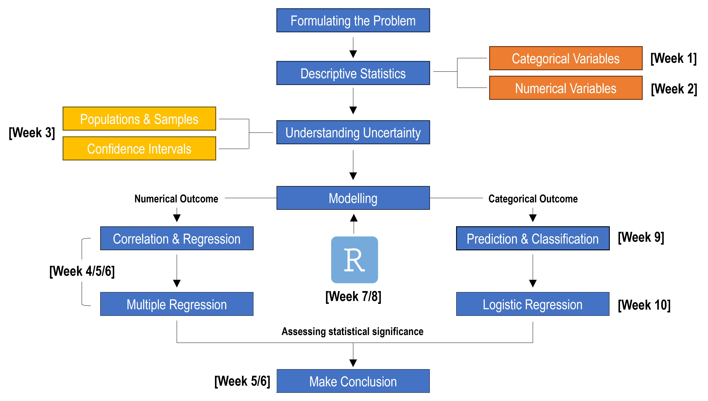

## Preface {.unnumbered}

Statistics is, at its heart, the language of evidence. In business and economics, it helps us make sense of uncertainty, identify patterns, and make better decisions — not by removing doubt, but by quantifying it. ETC1000: Business and Economic Statistics was designed to introduce students to this way of thinking: one grounded in data, guided by logic, and motivated by real-world questions.

This book serves as a companion for the ETC1000 unit, built on the principle that learning statistics is best achieved through doing, interpreting, and communicating — not memorising formulas. You’ll find that each chapter begins with a question or scenario that brings statistical thinking to life: from understanding whether a marketing campaign really boosted sales, to determining if housing prices differ between suburbs, or evaluating the fairness of a hiring process. These are the kinds of questions that analysts, economists, and business leaders face every day — and the kinds of skills you’ll develop throughout this unit.

Across the semester, we journey from descriptive to inferential statistics, from raw data to regression modelling, from spreadsheets to reproducible analysis in R. But more importantly, we move from numbers to stories — learning how to interpret, visualise, and explain statistical findings in ways that influence real decisions. This integration of computation and communication is at the heart of what it means to be data-literate in the modern world.

In this book, each chapter is designed to build naturally on the one before it, guiding you through the process of solving real-world problems using data. We usually begin with a clearly defined problem—this might be a research question, a business decision, or a practical scenario where evidence is needed to support an answer. From there, we introduce the statistical ideas, tools, and techniques that help move from raw data to meaningful conclusions:

<center>

```{r}
#| classes: .enlarge-image

```

</center>

ETC1000 has evolved over many years with input from hundreds of students and teaching staff. Their curiosity, feedback, and creativity have shaped the examples, visuals, and teaching strategies in these pages. Whether you’re studying statistics for the first time or revisiting it after years away, I hope this book helps you see statistics not as a hurdle to clear, but as a toolkit for discovery — one that empowers you to explore, question, and make sense of a complex world through data.

